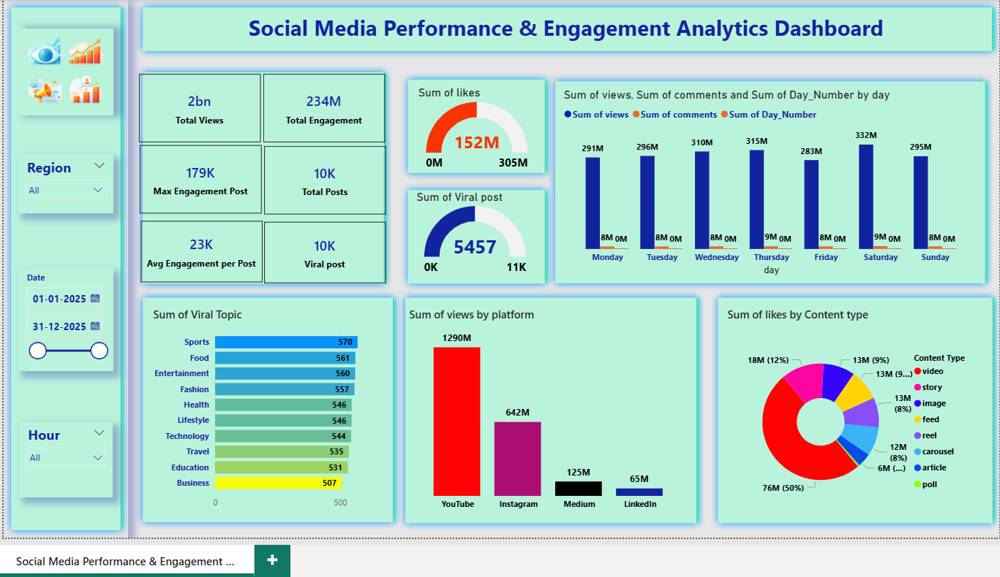

# 🚀 Social Media Performance & Engagement Analytics Dashboard

## 📌 Project Overview
This project analyzes social media performance and engagement metrics using **Python and Power BI**.  
The objective is to extract meaningful insights such as engagement trends, viral content performance, and platform-wise growth.

This is a complete **end-to-end data analytics project** including:
- Data Cleaning & Preprocessing (Python)
- Exploratory Data Analysis (Jupyter Notebook)
- KPI & Metrics Calculation
- Interactive Dashboard Creation (Power BI)
- Business Insights

---

## 🛠 Tools & Technologies Used
- Python (Pandas, NumPy, Matplotlib)
- Jupyter Notebook
- Power BI
- Data Visualization
- Git & GitHub

---

## 📊 Key Business Insights
- Identified top-performing platforms by views and engagement
- Analyzed likes, comments, and shares trends
- Found best posting days for engagement
- Detected viral content patterns
- Content-type performance comparison
- Engagement KPI tracking

---

## 📈 Dashboard Features
- Total Views, Total Engagement & Viral Posts KPI cards
- Platform-wise performance comparison
- Content-type engagement distribution
- Day-wise performance analysis
- Viral topic analysis
- Interactive filters (Region, Date, Hour)

---

## 🖼 Dashboard Preview

---

---

## 🎯 Business Value
This dashboard helps marketing teams to:
- Track social media performance
- Identify high-engagement content
- Optimize posting strategy
- Improve audience reach & growth
- Make data-driven marketing decisions

---

## 👨‍💻 Author
**Sumit Ghodke**  
Aspiring Data Analyst | Python | SQL | Power BI | Machine Learning  

🔗 LinkedIn:  
https://www.linkedin.com/in/sumit-ghodke-a45a82205/

